# Kiotrix Level 3
## Setup:
1. Download the Kioptrix VM from [Kioptrix level 3](https://www.vulnhub.com/entry/kioptrix-level-12-3,24/).
2. Use RAR to extract the compressed file.
3. Changing hosts:
    The readme file for the Virtual machine contained the following: 
    Before starting the machine, please modify your attacker's hosts file.
    <ip>	kioptrix3.com
    So we have to modify the hosts file in the directory /etc/hosts and add the ip
4. Launch VMware player and select the "Kioptrix level 3.vmx" file.(since Kipotrix uses DHCP, I used Bridged Networking)
5. Create a Kioptrix_3 directory within root's home directory, on the system.
## Information Gathering:
### Netdiscover:
We use this scanner to discover the vulnerable IP 
Here I got the IP of the vulnerable machine as 192.168.1.119

## Nmap:

After finding the IP, we scan it using nmap to find some info on the open ports 
```bash
nmap -sS -A -n [ip] 
``` 
we can see only 2 ports are open (22 and 80)

## Nikto:

We use nikto scan to find all those server side vulnerabilities and it shows that there is a phpmyadmin directory. By this we can assume that the site is connected to a database.

## SQL Injection: 

When we navigate to the website hosted by the machine, we get a blog page.

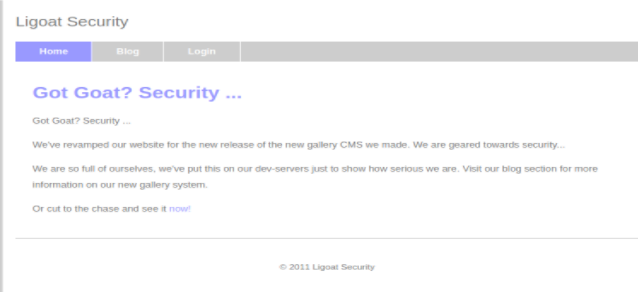

When we click now it moves to a gallery page


Here when we go to the sorting options and select sort by id, the url was 

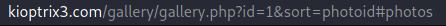

Now to check whether there is a SQL Injection vulnerability, I referred a page which helped me in SQL Injection => http://breakthesecurity.cysecurity.org/2010/12/hacking-website-using-sql-injection-step-by-step-guide.html 

So we can confirm that there is a SQL Injection vulnerability by modifying the url and adding ‘ after the id=1 which throws an error

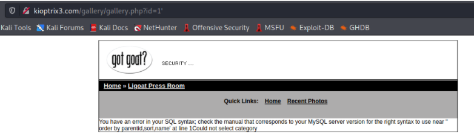

Now we find the number of columns in the table by adding order by n -- (n=1,2,3 ….) till we get an error in the page. Here we get an error when n = 7 so the number of columns = 6. 

Then we display the vulnerable columns by adding -1 union select 1,2,3,4,5,6--

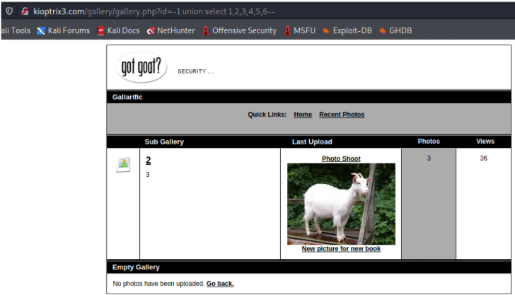

Here 2 and 3 are the vulnerable columns which get executed and displayed. **So now we can add some functions like version(), database(), user() in their place to check whether they are executed and can get displayed.** Then we try to display the table names.

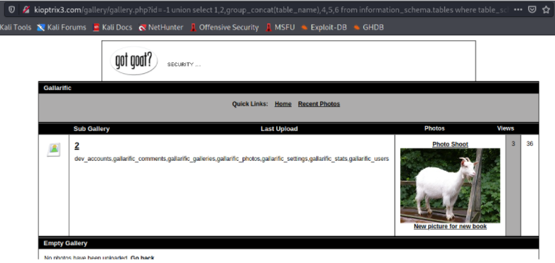

Here we can assume that dev_accounts might contain some useful information.

**Then we try to find the column names and for that the table name dev_accounts must be converted to MySql CHAR() string in order to execute the query.**

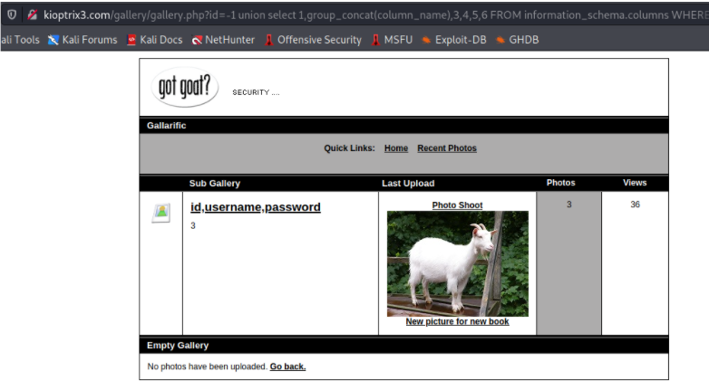

Here we found that there are 2 useful columns i.e username and password
Now after modifying the query we can get the username and password

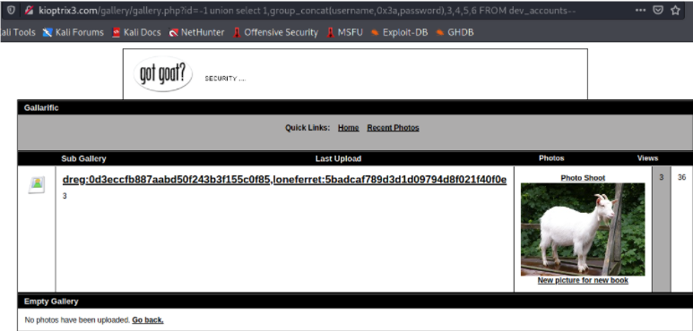

Then by using hashcat we can know about the hash type(MD5) and we can just use an online decrypter to decrypt the hash.

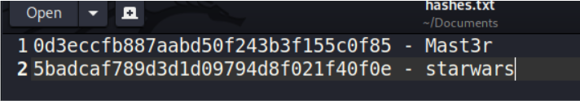


### Exploit
## Privilege Escalation:

After finding the passwords we can login ssh using these credentials. Now we have to escalate our privileges to root. 
When we list the directory,

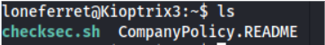

And when we check the readme file, 

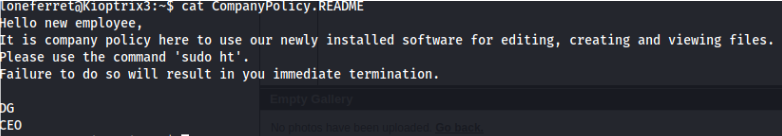

We use the command  
```bash
sudo ht /etc/sudoers 
```
to modify the file and escalate our privileges to root by adding 
```bash
/bin/sh 
```
to the privilege specification part.

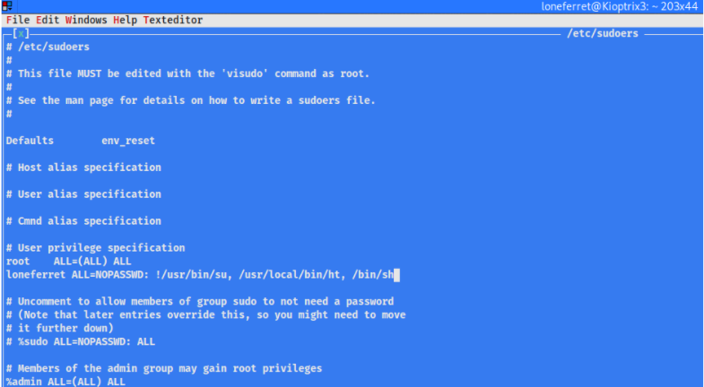

And finally we get root access by the command 
```bash
sudo /bin/sh
``` 
As we added that to the sudoers file.

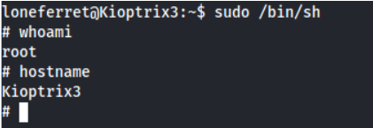
