# Kiotrix Level 5
### Setup:
1. Download the Kioptrix VM from [Kioptrix level 5](https://www.vulnhub.com/entry/kioptrix-2014-5,62/).
2. Use RAR to extract the compressed file.
3. Launch VMware player and select the "Kioptrix level 1.vmx" file.(since Kipotrix uses DHCP, I used Bridged Networking)
4. Create a Kioptrix_5 directory within root's home directory, on the system.

## Information Gathering:
### Netdiscover:
We use this scanner to discover the vulnerable IP 
Here I got the IP of the vulnerable machine as 192.168.1.159

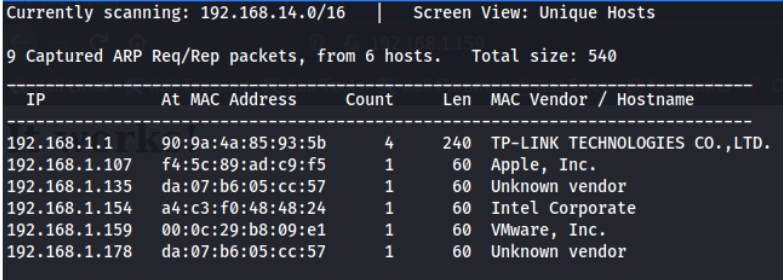

### Nmap:
After the ip has been found, we use nmap -sV -A to find all the open ports and services and also the OS and version detection. 
```bash
nmap -sV -A [ip]
```
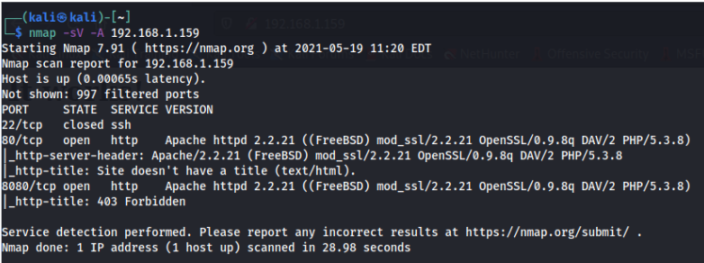

From this scan, we can see that port 80 and 8080 are open and port 8080 is forbidden.
When we check them out:

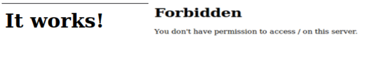

Which says that we don't have access on port 8080

### Directory Traversal:

When we inspect the page on port 80:

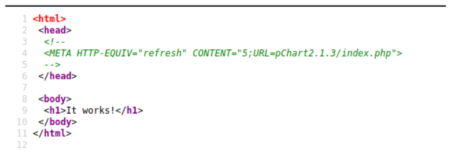

It shows a URL and when we navigate to it:

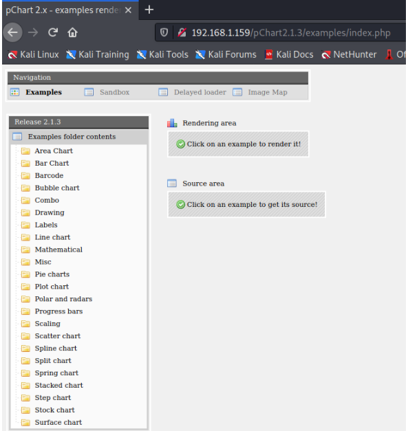

A pChart page opens up. **When we google this pChart 2.1.3 version, we can find that it has multiple vulnerabilities(https://www.exploit-db.com/exploits/31173 ).**

And it has a directory traversal vulnerability

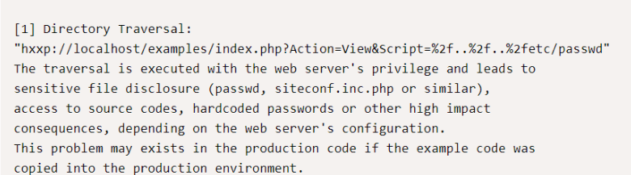

So when we try modifying the URL,

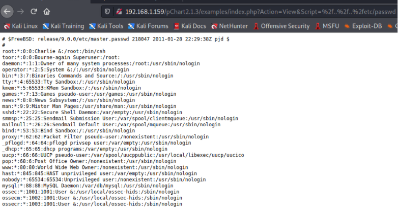

It worked. 

Now we try to access the Apache HTTP config file in which we may find some information regarding the forbidden page on port 8080.

When we search about Apache 2.2.21 under FreeBSD which we found in the nmap scan, we can find the directory in which the config file is located:

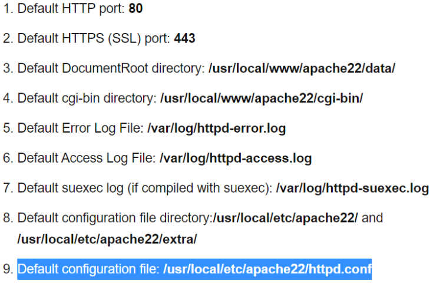

When we navigate to the directory:

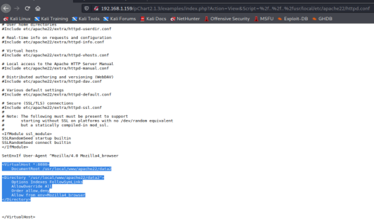

We get some information about the page at port 8080.

**The root directory for Port 8080 was located in /usr/local/www/apache22/data2** and there is an access-list which allowed only Mozilla/4.0 browsers to connect to the site. 

To bypass it, we have to navigate to 
```bash
about:config and add a string named general.useragent.override
``` 
and its value as 
```bash
Mozilla/4.0 (X11; Linux x86_64; rv:10.0) Gecko/20100101 Firefox/10.0.
```
This will bypass the access-list and now we will have access to the forbidden page.
### Remote Code Execution:
Now when we navigate to the page at port 8080:

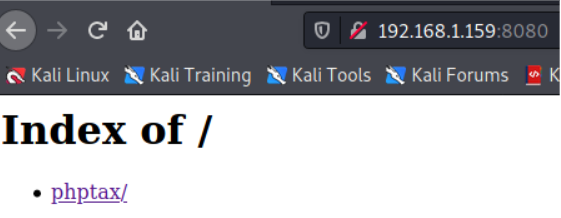

And if we follow the link:

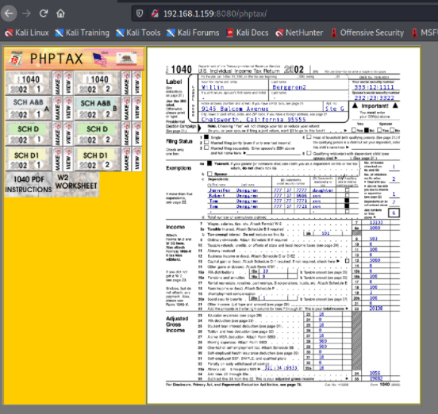

We get a tax return program called PHPTAX
When we google about this phptax, we can find a remote code execution exploit in this program.

https://www.rapid7.com/db/modules/exploit/multi/http/phptax_exec/

And this tells that we can use a module to perform a remote code execution attack.

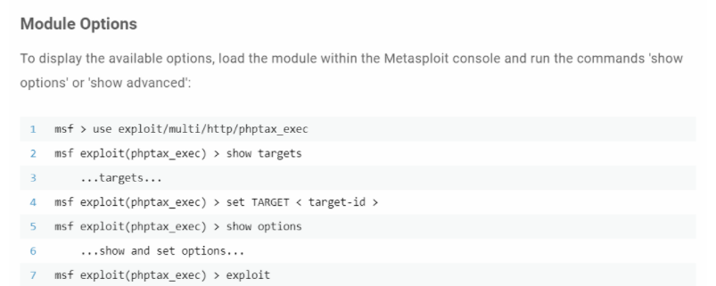

Now we can try to exploit using metasploit:
After setting RHOSTS and RPORT, 

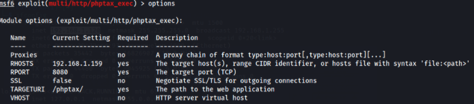

We can run the exploit:

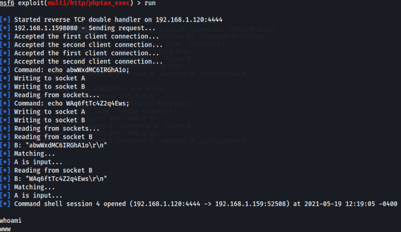

Now we have a shell active in the Kioptrix system, we can check the OS and Kernel versions:

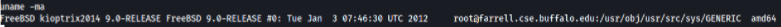

**If we google about that FreeBSD 9.0 version, we can find a local privilege escalation exploit.
https://www.exploit-db.com/exploits/28718**

And after finding that netcat and gcc was available, we can copy the exploit through netcat and run the exploit:

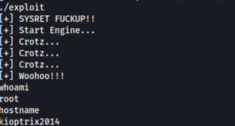

**Finally we got root access**


